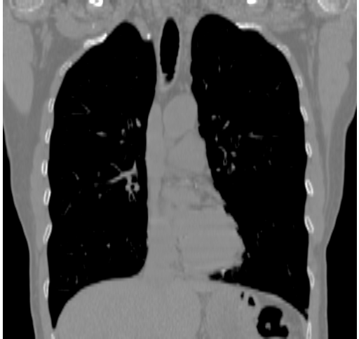
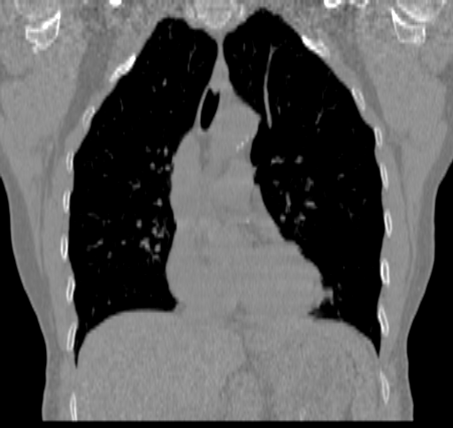

# registerGL

2d non-rigid image registration using WebGL.

## Algorithm

Build using Thirion's Demon's registration.

Two floating images are pre-computed.  The first is the fixed image, where the red channel is image intensity, the blue channel the `dx` and the red channel, `dy`.  The second image is the moving image.  It is initialized with the red channel as image intensity, the blue and green channels are `dx` and `dy` of the displacement, respectively.

At each update, the two images are given to a GLSL kernel.  The rendered image consists of $( I_m^t, dr_x, dr_y )$.  A smoothing kernel 

### Image Representations

Images are represented as floating point textures, with image magnitude stored in the `r` channel.  Gradients are stored as floating point textures, with `dx` in the `r`, `dy` in the `g` channels, and gradient magnitude in `b`.

### Kernels Needed

- `gradient.fs` -- Given an image texture, compute the gradient.  `r,g,b` channels are `dx, dy, magnitude`.
  - **parameters:**
  - `delta` spatial difference to neighboring pixel, relative to image size, i.e. $(1.0 / width)$
- `smooth.fs` -- Given an image texture, compute the gradient.  Smoothing occurs in the `r` and `g` channels to cover both images and gradients. Always calculated in a `20x20` window, and the `b` and `a` channels are passed through.
  - **parameters:**
  - `sigma` width of Gaussian, expressed as a floating point value relative to the image size, i.e. $( 1 / width )$
  - `direction` calculate in `x` or `y` for the separable filter
- `displacement.fs` -- calculate the displacement vector.
  - **parameters:**
  - `movingImage` -- updated moving image
  - `movingImageGradient` -- gradient of moving image
  - `fixedImage` -- fixed image
  - `fixedImageGradient` -- gradient of fixed image
  -  multiple images, possibly `alpha` factors, etc
- `updateR` -- update the `r` displacement vector image, basically a sum of `r` and `dr`
  - **parameters:**
  - `r` and `dr` images
- `displace.fs` -- displace the moving image
  - **parameters:**
  - `movingImage` -- image to update
  - `r` -- displacement vector field


# Data

Data are kindly provided by the [Deformable Image Registration Laboratory](http://www.dir-lab.com).  The `copd1` data is a `512 x 512 x 121` image of little-endian unsigned integer.  Voxels are `0.625 x 0.625 x 2.5`.  The images were downloaded after access was granted.  Images were processed using [Slicer](https://www.slicer.org/) and [Fiji](http://fiji.sc/) to generate simple PNG files of inspiration and expiration.  To read into the image processing software, a [NRRD](http://teem.sourceforge.net/nrrd/format.html) header file was created, allowing Slicer and Fiji to read the volume data.

```
NRRD0005
content: copd1_iBHCT
data file: copd1_iBHCT.img
encoding: raw
dimension: 3
type: ushort
endian: little
sizes: 512 512 121
# space: right-anterior-inferior
spacings: 0.625 0.625 2.5
```




# Build

```bash
gulp  # open http://localhost:3000
```

# Libraries

jQuery

[es6-promise](https://github.com/stefanpenner/es6-promise)
